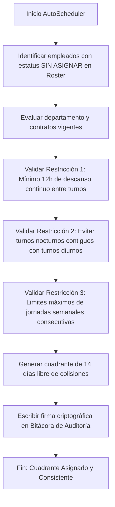

# Krono: Documentación de Módulos e Ingeniería de Software

Este documento proporciona una descripción detallada de la arquitectura de Krono, explicando el funcionamiento de sus módulos principales y profundizando en el **Módulo de Turnos y Calendarios**, que representa el componente de mayor complejidad algorítmica y funcional de la plataforma.

---

## 🏛️ Arquitectura de Datos y Estado Centralizado

Krono opera bajo un patrón de **estado centralizado y flujo de datos unidireccional** dentro de React. El componente raíz [App.jsx](file:///c:/Projects/Krono/src/App.jsx) gestiona toda la base de datos simulada en memoria y provee a los componentes hijos los datos (`shiftsState`, `employees`, `incidents`, etc.) junto con funciones de callback para mutaciones seguras (por ejemplo, `handleAddAuditLog`, `handleAdjustPunch`, `handleResolveIncident`).

Esta arquitectura asegura que cualquier cambio realizado en un módulo específico (como la aprobación de una solicitud de marcaje retroactivo en ESS o el ajuste manual de un registro de asistencia) se propague inmediatamente a todos los demás componentes (como el Dashboard, la Asistencia en Vivo y la Pre-Nómina) manteniendo la consistencia de los datos en tiempo real.

---

## 📦 Resumen de Módulos Clave

A continuación se describen los módulos funcionales de la plataforma, implementados dentro de la carpeta [src/components](file:///c:/Projects/Krono/src/components):

### 1. Panel de Control General ([Dashboard.jsx](file:///c:/Projects/Krono/src/components/Dashboard.jsx))
*   **Función Principal:** Ofrece una vista ejecutiva unificada de la operación.
*   **Detalles Técnicos:**
    *   Tarjetas de KPI reactivas que muestran: porcentaje de asistencia, total de empleados presentes/ausentes/tardíos/descansando, incidentes críticos acumulados y precisión promedio del GPS.
    *   Monitor de estado del servidor con simulación de sincronización periódica (Latencia local <-> Nube).
    *   Muestra un canal directo de marcas en vivo (Live Clock-in Feed) y un listado de alertas de seguridad recientes.

### 2. Monitoreo en Tiempo Real ([LiveAttendance.jsx](file:///c:/Projects/Krono/src/components/LiveAttendance.jsx))
*   **Función Principal:** Monitorear activamente las entradas, salidas y el estatus actual de toda la plantilla de empleados durante la jornada en curso.
*   **Detalles Técnicos:**
    *   **Metadatos de Registro:** Captura e inspecciona la red WiFi (SSID/BSSID), huella del dispositivo (navegador, sistema operativo), precisión GPS, y estado de autenticación biométrica (FaceID/TouchID local).
    *   **Ajustes de Marcaje de Emergencia:** Permite a los administradores ajustar manualmente horas de entrada y salida, requiriendo una nota de justificación obligatoria. Esto genera automáticamente un registro en la pista de auditoría.
    *   **Waiver (Exenciones):** Flujo de un solo clic para aprobar excepciones por retardos de forma justificada directamente desde la fila del empleado.

### 3. Registro de Asistencia Digital ([DigitalClockIn.jsx](file:///c:/Projects/Krono/src/components/DigitalClockIn.jsx))
*   **Función Principal:** Simular el dispositivo de marcaje de un empleado en la aplicación móvil o en un quiosco digital.
*   **Detalles Técnicos:**
    *   **Código QR Dinámico (TOTP):** Genera códigos QR que cambian cada 15 segundos mediante un token basado en tiempo para evitar capturas de pantalla y suplantación de identidad.
    *   **Geoposicionamiento Simulador:** Permite ajustar la distancia simulada a la geocerca para probar el rechazo de marcajes fuera del radio permitido (ej. > 50 metros).
    *   **Cola de Sincronización Fuera de Línea:** Almacena marcajes localmente en caso de pérdida de red y los sincroniza automáticamente cuando se restablece la conexión.

### 4. Flujo de Incidencias ([Incidents.jsx](file:///c:/Projects/Krono/src/components/Incidents.jsx))
*   **Función Principal:** Detección de anomalías en el cumplimiento de horarios de acuerdo con el Roster.
*   **Detalles Técnicos:**
    *   Distingue excepciones como: *Retardo (Tarde)*, *Salida Anticipada*, *Ausencia Total* y *Registro Huérfano* (marcar entrada pero no salida, o viceversa).
    *   Gestión de acuerdos de nivel de servicio (SLA) visualizados mediante barras de tiempo decrecientes.
    *   Flujos de resolución administrativa: aprobar justificaciones, aplicar penalizaciones o escalar a RRHH.

### 5. Pre-Nómina e Integración ([PayrollOvertime.jsx](file:///c:/Projects/Krono/src/components/PayrollOvertime.jsx))
*   **Función Principal:** Consolidar horas trabajadas y calcular compensaciones financieras en base a horas extras.
*   **Detalles Técnicos:**
    *   Desglose preciso de Horas Ordinarias frente a Horas Extras con multiplicadores configurables (1.5x por tiempo extra estándar, 2.0x por trabajo en domingos o días libres).
    *   Cálculo automático de bonificaciones para días festivos laborados (1.75x o Doble Base según matriz oficial).
    *   Función de "Cierre de Nómina" (Payroll Lock) con firma digital criptográfica de integridad y exportación compatible con ERPs en formatos estructurados.

### 6. Autoservicio del Empleado ([EssRequests.jsx](file:///c:/Projects/Krono/src/components/EssRequests.jsx))
*   **Función Principal:** Canal bidireccional donde los empleados solicitan correcciones o justificaciones de asistencia.
*   **Detalles Técnicos:**
    *   Tipos de solicitudes soportadas: Marcaje Retroactivo, Corrección de Marcaje, Justificación de Ausencias e Intercambio de Turnos (Shift Swapping).
    *   Soporta la carga de evidencias digitales (simulación de carga de archivos PDF o JPG de justificantes médicos o de transporte).
    *   Validación de geoposicionamiento en el momento de realizar la solicitud.

### 7. Control de Visitantes ([Visitors.jsx](file:///c:/Projects/Krono/src/components/Visitors.jsx))
*   **Función Principal:** Registrar y autorizar el acceso de personal externo a las instalaciones físicas.
*   **Detalles Técnicos:**
    *   Genera credenciales QR temporales con rangos de validez estrictos.
    *   Flujo de pre-registro por parte del anfitrión (host) interno.
    *   Al arribar el visitante, se ejecuta una verificación por geocerca y se despacha una notificación de alerta al anfitrión en tiempo real.

### 8. Salas de Reunión ([MeetingRooms.jsx](file:///c:/Projects/Krono/src/components/MeetingRooms.jsx))
*   **Función Principal:** Gestión y optimización del uso de salas de juntas y espacios de coworking.
*   **Detalles Técnicos:**
    *   Integración con sensores simulados de presencia IoT.
    *   **Regla "Anti-NoShow":** Si no se registra presencia física en la sala (o una confirmación digital) dentro de los primeros 10 minutos de la reserva, el sistema cancela automáticamente la reserva del espacio y actualiza el Roster de salas, optimizando la capacidad instalada.

### 9. Estructura Organizativa ([Organization.jsx](file:///c:/Projects/Krono/src/components/Organization.jsx))
*   **Función Principal:** Administrar departamentos, sucursales y parámetros de validación física.
*   **Detalles Técnicos:**
    *   Configuración de geocercas globales por sucursal (Latitud, Longitud y Radio de tolerancia en metros).
    *   Lista blanca de redes WiFi corporativas autorizadas (mapeo estricto de SSIDs y BSSIDs de puntos de acceso).

### 10. Bitácora de Auditoría ([AuditTrail.jsx](file:///c:/Projects/Krono/src/components/AuditTrail.jsx))
*   **Función Principal:** Garantizar el cumplimiento regulatorio e inmutabilidad de los datos del sistema.
*   **Detalles Técnicos:**
    *   Registro estricto de todas las mutaciones realizadas por administradores o sistemas automáticos.
    *   Para cada registro se captura: Actor, Acción, Entidad Afectada, Valor Previo, Valor Nuevo, Dirección IP, Huella del Dispositivo y Marca de tiempo UTC.
    *   **Seguridad:** Cada evento incluye una firma criptográfica SHA-256 (simulada) que valida que los registros no han sido alterados manualmente en base de datos.

### 11. Ajustes y Configuración ([Settings.jsx](file:///c:/Projects/Krono/src/components/Settings.jsx))
*   **Función Principal:** Panel de administración global del sistema.
*   **Detalles Técnicos:**
    *   Configuración de límites globales: radio de geocercas en metros, tiempo de expiración del TOTP, requerimiento de FaceID/huella biométrica, y políticas de inicio de sesión seguro (MFA).
    *   Opciones para exportar la base de datos simulada en JSON o CSV y restaurar el sistema a valores por defecto.

---

## ⚙️ Módulo de Turnos y Calendarios (`ShiftsCalendars.jsx`)

El módulo implementado en [ShiftsCalendars.jsx](file:///c:/Projects/Krono/src/components/ShiftsCalendars.jsx) es la sección más compleja del sistema. A diferencia de las soluciones tradicionales de asistencia basadas únicamente en registros lineales de entrada y salida, Krono implementa un **motor bidireccional de asignación horaria, cuadrantes flexibles y validación algorítmica**.

El módulo está estructurado en torno a cinco pilares de lógica y una matriz de excepciones.

### 1. Biblioteca de Horarios (Catálogo)
Este componente permite dar de alta y estructurar las reglas operativas de cada jornada laboral. Un horario en Krono no es solo una hora de inicio y fin, sino una estructura enriquecida de reglas de cumplimiento:

| Parámetro | Propósito |
| :--- | :--- |
| **Tipo de Horario** | Identifica el comportamiento de la jornada (`FIJO`, `FLEXIBLE`, `NOCTURNO`, `EXTENSO`, `DESCANSO`). |
| **Ventana de Marcaje** | Define intervalos específicos en los que se permite marcar entrada y salida (evita marcajes a horas indebidas). |
| **Tolerancia (Grace Period)** | Margen de minutos posteriores a la hora de inicio antes de que el sistema compute un "Retardo" (ej. 10 minutos). |
| **Umbral de Horas Extras (OT)** | Minutos adicionales al fin de jornada que deben transcurrir antes de empezar a acumular horas extras (evita el pago de minutos aislados). |
| **Regla de Almuerzo** | Define si el descanso para alimentos es `AUTOMATICO` (se descuenta un lapso fijo, ej. 60 min, tras transcurrir un tiempo) o `REGISTRADO` (el empleado debe marcar la salida y entrada al almuerzo). |

### 2. Ciclos de Turnos (Secuencias N-Días)
Define secuencias periódicas de horarios aplicables a un rol determinado. Admite dos tipos principales de secuencias:
1.  **Ciclo Semanal Estándar (7 días):** Secuencia fija vinculada a días calendario específicos (ej. Lunes a Viernes de 8:00 a 17:00, Sábados y Domingos de Descanso Libre).
2.  **Ciclos Rotativos Personalizados (Secuencias N-Días):** Permite diseñar secuencias repetitivas continuas que no dependen de la semana natural de 7 días. Por ejemplo:
    *   *Ciclo de Vigilancia 12x24 (4 días):* Día de Trabajo [DF1] -> Descanso [LIB] -> Turno Nocturno [NOC] -> Descanso [LIB].
    *   *Guardia Médica 24x48 (3 días):* Guardia 24 horas [G24] -> Descanso [LIB] -> Descanso [LIB].

El usuario puede configurar la duración del ciclo (de 1 a 14 días) y asignar un horario del catálogo a cada posición secuencial.

### 3. Asignador de Turnos
Se encarga de mapear los ciclos de turnos a los recursos operativos en un rango temporal definido:
*   **Modos de Asignación:** Por Departamento completo o por Empleado individual.
*   **Asignaciones Permanentes:** Ciclos recurrentes sin fecha límite de vigencia.
*   **Excepciones y Reemplazos Temporales:** Permite aplicar un ciclo específico o un horario único para un período corto (ej. cobertura por incapacidad o turnos especiales por inventario), el cual sobrescribe el ciclo permanente únicamente durante los días seleccionados.
*   **Priorización de Excepciones:** La lógica valida primero si existe una asignación temporal activa para el empleado en la fecha evaluada; si no existe, busca la asignación permanente del empleado; y por último, hereda la asignación general del departamento al que pertenece.

### 4. Cuadrante Operativo (Roster Grid)
Es una matriz visual tipo hoja de cálculo que muestra a los empleados en el eje vertical (Y) y los días del rango seleccionado en el eje horizontal (X), mostrando un bloque de color por cada turno asignado:
*   **Edición Dinámica en Celda (Inline Editing):** Al hacer clic sobre cualquier celda del cuadrante, se despliega una interfaz que permite cambiar en caliente el turno asignado a ese empleado específico para ese día particular.
*   **Persistencia y Auditoría:** Modificar una celda recalcula en tiempo real el plan de asistencia mensual del empleado y registra un evento en la pista de auditoría (`AJUSTE_ROSTER`).

### 5. Algoritmo de Autoprogramación (AutoScheduler)
Es el motor inteligente de Krono para la resolución automática de cuadrantes vacíos o con personal "Sin Asignar". Al ejecutarse, ejecuta las siguientes validaciones y restricciones en tiempo real:

*Restricciones Clave Validadas:*
1.  **Restricción de Descanso Fisiológico:** Garantiza que no se asigne un turno diurno que inicie inmediatamente después de un turno nocturno o extenso, exigiendo al menos 12 horas continuas de descanso inter-jornada.
2.  **Prevención de Fatiga (Colisión Nocturna):** Evita la asignación de turnos nocturnos contiguos sin días libres de por medio.
3.  **Firma Criptográfica:** Cuando el algoritmo resuelve el cuadrante de forma exitosa, genera un hash SHA-256 de control para asegurar la integridad de la programación autogenerada, guardando la evidencia en el módulo de auditoría.

---

## 🌙 Lógicas Especiales de Alta Complejidad

### A. Gestión de Turnos Cruzados (Cross-Day)
En industrias con operaciones continuas de 24 horas, los turnos nocturnos inician en un día del calendario (ej. 22:00 del lunes) y concluyen en el siguiente (ej. 06:00 del martes).
*   **El Problema Común:** Los sistemas tradicionales registran la entrada del lunes y marcan la salida del martes como una salida sin entrada asociada (marcajes huérfanos), generando falsas alertas de incidencias.
*   **Solución de Krono:** Aplica la regla de `VINCULAR_DIA_ANTERIOR`. Cuando un empleado registra una salida, el sistema busca hacia atrás en un margen de hasta `4 horas` (Buffer Hours) posteriores al fin del turno esperado si existe una entrada huérfana de la noche anterior. Si la encuentra, enlaza dinámicamente ambos marcajes en una única sesión laboral coherente, asociándola al día en que inició el turno y evitando incidencias innecesarias.

### B. Matriz de Feriados Nacionales
Krono incorpora una matriz de días festivos oficiales configurables por región geográfica:
*   Al procesar el registro de asistencia en un día marcado como festivo en el calendario oficial, el daemon del sistema aplica automáticamente la regla de compensación parametrizada (ej. `FERIADO_TRABAJADO`).
*   Esto muta el estado salarial del empleado para esa jornada, aplicando el factor de incremento de nómina (ej. pago al 1.75x o doble base según la legislación local) sin requerir intervención manual de los analistas de nómina.
